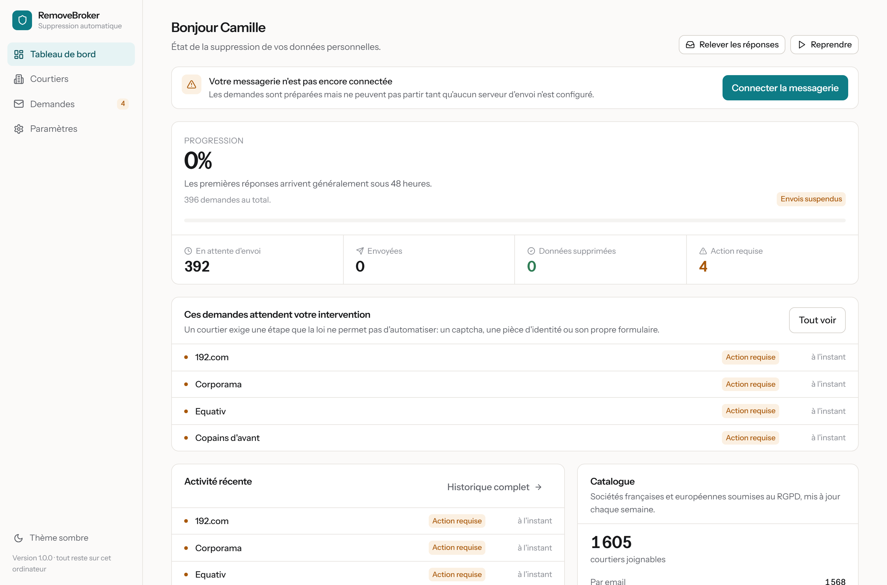
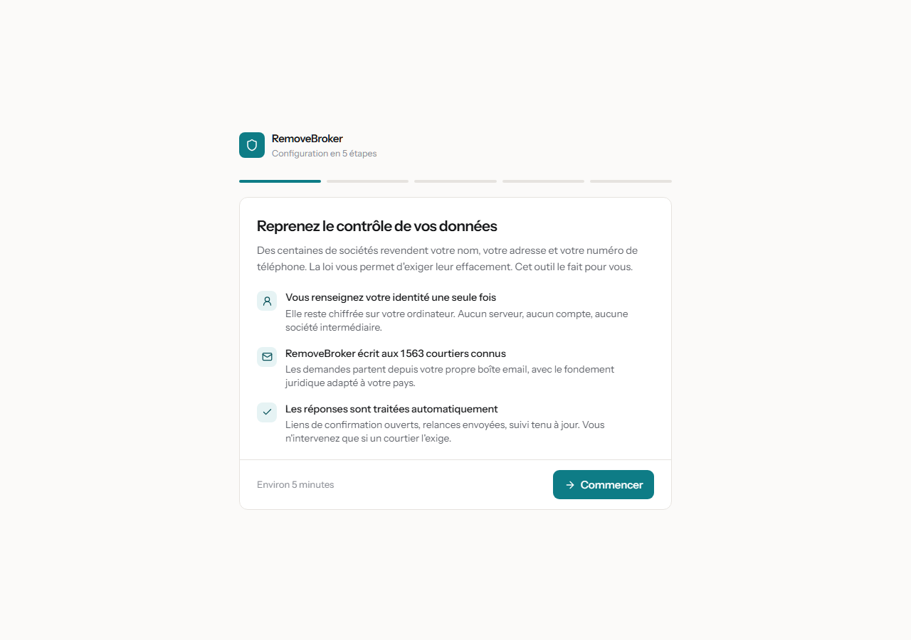
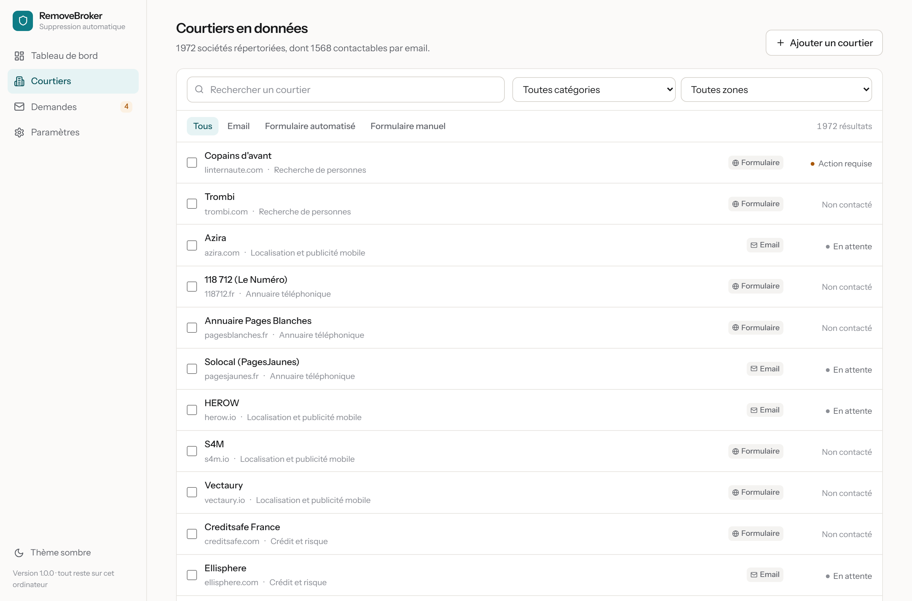

# RemoveBroker

A free, open source alternative to Incogni, built for France and Europe. Enter
your identity once, and the application writes to the companies that exploit
your personal data, demanding erasure under the GDPR, then tracks the replies on
its own.

Everything runs on your machine. No account, no server, no subscription, no data
leaving your computer.

[Version française](README.md) · [Installation](docs/INSTALLATION.md) ·
[Usage](docs/UTILISATION.md) · [Contributing](docs/CONTRIBUER.md)



## The problem

Companies you have never dealt with hold your name, address, phone number, the
list of your relatives and your purchase history, and they sell it. The GDPR
gives you the right to demand erasure, with a mandatory reply within one month,
but exercising it means writing to every single company, then chasing them.

Incogni does that work for roughly 90 euros a year, with a mostly American
catalogue. RemoveBroker does it for free, on the perimeter that actually
concerns you when you live in France.

## A European catalogue, France first

**1,605 reachable companies**, including **108 French ones**, all subject to the
GDPR.

The headline figure counts companies a request can actually be sent to, backed
by an address or a form. The catalogue lists 1,972: for the remaining 367 no
contact has been found yet, and counting them would inflate a number you cannot
use.

The entry criterion is not the head office but the data: a US company that
processes the data of people living in Europe falls under the GDPR and must
answer. Acxiom, LiveRamp and Kochava hold French people's data and are listed.
A Texas court-records directory is not: it holds nothing about someone who never
lived in the United States. 863 such entries were removed. See
[the scope](docs/PERIMETRE.md).

Five sources are merged weekly, three of them specifically European: the IAB
Europe TCF vendor list, the Datenanfragen GDPR contact database, and a French
and European list maintained in this repository.

## What it does

- **The advertising-identifier chain**, the one linking your IDFA or AAID to
  your movements: Kochava, Azira, Outlogic, Foursquare, Blis, Criteo, Sirdata,
  ID5, Utiq and the twenty-odd others that make up this market.
- **Erasure requests by email**, sent from your own mailbox, written in French
  or English with the legal basis matching your country: GDPR article 17, or UK
  GDPR.
- **Automated form filling** for brokers that refuse email, covering the most
  common sites.
- **Automatic reply handling**: the app polls your mailbox, recognises
  confirmations, refusals and verification requests, opens confirmation links,
  and follows up after 30 days.
- **A ready-to-send complaint letter** for your data protection authority when a
  broker misses the legal deadline.
- **An exportable evidence file**: a timestamped copy of every message sent and
  received, ready to attach to a complaint.

You only step in when the law requires it: a captcha, an ID document demanded by
the broker, a form that refuses any automation.

## Installation

### The simple way

Download the installer for your system from the
[releases page](https://github.com/RDSV01/RemoveBroker/releases) and run
it. Nothing else to install.

| System | File |
| --- | --- |
| Windows 10/11 | `RemoveBroker-1.0.0-installateur.exe` |
| macOS | `RemoveBroker-1.0.0-arm64.dmg` or `-x64.dmg` |
| Linux | `RemoveBroker-1.0.0-x86_64.AppImage` or `-amd64.deb` |

The installers are unsigned, so Windows and macOS will warn you on first launch.
[docs/INSTALLATION.md](docs/INSTALLATION.md) explains how to proceed and lists
the SHA256 checksums.

### From source

```bash
git clone https://github.com/RDSV01/RemoveBroker.git
cd RemoveBroker
npm install
npm run build
npm start           # then open http://127.0.0.1:7777
```

Node.js 20.11 or newer. For the desktop window instead of a browser tab:
`npm run desktop`.

## Getting started

Five screens on first launch:



1. **Your identity** — first name, last name, email addresses, phone, postal
   address. This is what brokers use to find your record. An optional field
   asks for your phone advertising identifier: location brokers index neither
   your name nor your address, and it is the only key they can act on.
2. **Your country** — determines the law invoked and the authority to complain
   to.
3. **Your mailbox** — Gmail, Outlook, iCloud and about thirty other providers
   are preconfigured. You paste an app password, never your real password.
4. **Launch** — the app shows how many requests will go out and over how many
   days.

After that there is nothing to do. The dashboard shows progress, and the
"Demandes" badge flags the rare cases needing your attention.

### App passwords

Gmail and other providers refuse to let software sign in with your normal
password. They issue a dedicated, revocable password limited to sending and
reading mail. The app shows the direct link to the right page for your provider
and verifies the connection before moving on.

## How your data is protected

- **Nothing leaves your computer** except the emails you send to brokers and the
  catalogue download from GitHub.
- **No telemetry.** No usage statistics, no remote crash reporting, no call home
  on startup.
- **Encrypted at rest.** Profile, mail credentials and history are encrypted
  with AES-256-GCM. The key is sealed by the operating system keychain (DPAPI on
  Windows, Keychain on macOS) or by a passphrase you choose.
- **Minimal local logs**, clearable from the settings.
- **One-button wipe**: profile, history, key, everything.

The full security model is in [docs/VIE-PRIVEE.md](docs/VIE-PRIVEE.md).

## The catalogue updates itself

New brokers appear every month. A GitHub Actions workflow rebuilds the catalogue
weekly from the public sources and commits it to this repository. Your install
downloads it, checks the SHA256 digest, and tells you about the new companies.
With automatic sweeping enabled, requests go out without you thinking about it.

This costs nobody anything: the catalogue is a static file served by GitHub, so
there is no server to pay for.



## Contributing

The most useful contribution: **adding the French companies that are missing.**
Adding one takes ten lines of YAML in
[`catalog/overrides/eu-fr.yaml`](catalog/overrides/eu-fr.yaml):

```yaml
- name: Company name
  domain: example.eu
  website: https://www.example.eu
  email: dpo@example.eu
  optOutUrl: https://www.example.eu/your-rights
  category: marketing
  regions: [eu, fr]
```

[docs/CONTRIBUER.md](docs/CONTRIBUER.md) covers the details, including how to
write a form automation recipe.

## Roadmap

- Automation recipes for French and European forms: only one recipe remains,
  the others targeted US sites removed from the scope.
- Optional captcha solving through a third-party service, user's choice.
- Interface translations: English, German, Spanish.
- Reply detection in German, Spanish and Italian.
- Tracking records that reappear after deletion.

## Origin

Three existing projects served as the starting point. RemoveBroker takes the
best of each and fills the gaps they all had:

| Project | What was taken | What was missing |
| --- | --- | --- |
| [eraser](https://github.com/digisamroc/eraser) | Broker list with email addresses, batch sending | No reply tracking, minimal interface |
| [auto-identity-remove](https://github.com/stephenlthorn/auto-identity-remove) | Browser-driven form automation | No persistence, no interface |
| [optery-data-brokers-directory](https://github.com/optery/optery-data-brokers-directory) | Structured directory, opt-out guides | Data only, no tooling |

None of the three handled replies, encrypted anything, or covered Europe. This
one does.

## Licence

[AGPL-3.0](LICENSE). Deliberate: anyone may use, modify and redistribute this
code, but anyone turning it into a hosted service must publish their changes. A
privacy tool turned into a closed service would no longer be verifiable, and so
no longer trustworthy.

## Disclaimer

RemoveBroker sends requests on your behalf based on rights the law grants you.
It bypasses no protection, impersonates nobody, and respects mail provider
sending limits. Brokers remain free to answer or not; on silence, the app
prepares the complaint for the competent authority. This project is not legal
advice.
