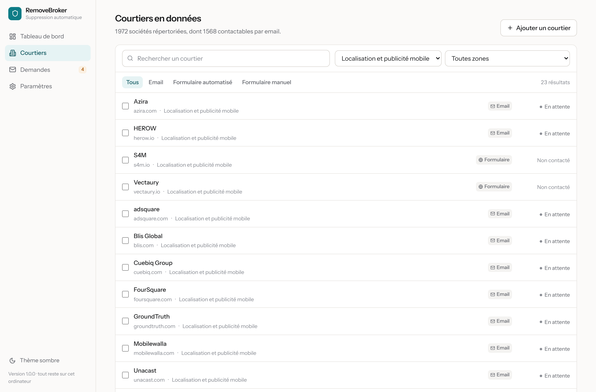

# RemoveBroker

Alternative libre et gratuite à Incogni, pensée pour la France et l'Europe.
Vous renseignez votre identité une fois, l'application écrit aux sociétés qui
exploitent vos données personnelles pour exiger leur effacement au titre du
RGPD, puis suit les réponses toute seule.

Tout s'exécute sur votre ordinateur. Aucun compte, aucun serveur, aucun
abonnement, aucune donnée qui sort de chez vous.

[English version](README.en.md) · [Installation](docs/INSTALLATION.md) ·
[Utilisation](docs/UTILISATION.md) · [Contribuer](docs/CONTRIBUER.md)


## Le problème

Des sociétés que vous n'avez jamais contactées détiennent votre nom, votre
adresse, votre numéro de téléphone, vos centres d'intérêt et vos déplacements.
Elles les revendent. L'article 17 du RGPD vous donne le droit d'exiger leur
effacement, avec une réponse obligatoire sous un mois, mais l'exercer suppose
d'écrire à chaque société, une par une, puis de relancer.

Incogni fait ce travail pour environ 90 euros par an. RemoveBroker le fait
gratuitement, sur le périmètre qui vous concerne réellement quand vous vivez en
France.

### Ce que couvre Incogni, ce que couvre RemoveBroker

Les deux catalogues se recoupent peu. Sur les 420 entrées annoncées par Incogni,
environ 200 sont des sites de recherche de personnes américains, et 140 des
compilateurs de listes marketing.

| | Incogni | RemoveBroker |
| --- | --- | --- |
| Recherche de personnes aux États-Unis | ~200 | 11 |
| Compilateurs de listes marketing | ~140 | oui |
| Publicité programmatique européenne | non | 1 785 |
| Localisation revendue à la publicité | non | 23 |
| Crédit et solvabilité | Equifax, TransUnion | plus SCHUFA, Creditsafe, CRIF |
| Sociétés françaises | quasi aucune | 110 joignables |

Vérifié sur leur [liste publique](https://blog.incogni.com/data-brokers-incogni-covers/)
en août 2026: Kochava, Azira, Outlogic, Placer.ai, Foursquare et Blis n'y
figurent pas, pas plus que Criteo, Sirdata, Weborama, Ogury, Numberly, LiveRamp
ou The Trade Desk. Ils sont profonds là où nous sommes vides, et l'inverse est
vrai.

## Un catalogue européen, la France d'abord

**1 607 sociétés joignables**, dont **110 françaises**, toutes soumises au RGPD.

Le chiffre annoncé est celui des sociétés à qui une demande peut effectivement
partir, adresse ou formulaire à l'appui. Le catalogue en répertorie 1 971: pour
les 364 restantes, aucun contact n'a encore été trouvé, et les compter serait
gonfler un nombre que vous ne pouvez pas utiliser.

Le critère d'entrée n'est pas le siège social mais la donnée: une société
américaine qui exploite les données de personnes en Europe relève du RGPD et
doit répondre. Acxiom, LiveRamp ou Kochava détiennent des données françaises et
figurent donc au catalogue. Un annuaire de casiers judiciaires du Texas, non:
il ne détient rien sur une personne qui n'a jamais vécu aux États-Unis, et lui
écrire ne produirait qu'une réponse « aucune donnée vous concernant ».

| Ce que fait la société | Nombre |
| --- | --- |
| Publicité ciblée, segments d'audience | 1 785 |
| Prospection commerciale B2B | 115 |
| Crédit et solvabilité | 30 |
| Localisation revendue à la publicité | 23 |
| Annuaires, recherche et vérification de personnes | 18 |

Cinq sources sont fusionnées chaque semaine, dont trois spécifiquement
européennes:

- **Liste des fournisseurs du cadre de consentement européen (IAB Europe TCF)**:
  les 1 136 sociétés qui traitent les données des internautes européens à des
  fins publicitaires, avec la politique de confidentialité que chacune publie.
- **Base de contacts RGPD Datenanfragen**, tenue par une association allemande,
  vérifiée à la main, versée au domaine public.
- **Liste française et européenne maintenue dans ce dépôt**: Solocal, Criteo,
  Sirdata, Weborama, Ogury, Numberly, Kaspr, Nomination, Creditsafe, SCHUFA et
  les autres.

Les deux dernières sources, le registre californien et l'annuaire Optery, ne
servent plus qu'à identifier les acteurs mondiaux soumis au RGPD.

## Ce que fait l'application

- **Des demandes d'effacement par email**, envoyées depuis votre propre boîte,
  rédigées en français avec l'article 17 du RGPD et le délai d'un mois.
- **La recherche du contact quand il est introuvable**: l'application lit
  elle-même la politique de confidentialité de la société avec un vrai
  navigateur, en tire l'adresse du délégué à la protection des données, et
  poursuit sans rien vous demander.
- **Le remplissage des formulaires** des sociétés qui n'acceptent pas l'email,
  assisté par défaut, entièrement automatique en option quand aucun captcha ne
  protège la page.
- **Le traitement automatique des réponses**: relève de votre boîte, ouverture
  des liens de confirmation, relance après 30 jours.
- **Une lettre de plainte prête à envoyer** à la CNIL ou à l'autorité de votre
  pays quand une société ne répond pas dans le délai légal.
- **Un dossier de preuves exportable**, horodaté, à joindre à une plainte.

Vous n'intervenez que lorsque la loi l'impose: un captcha, une pièce d'identité
réclamée par la société, un formulaire qui refuse toute automatisation.

## Installation

### La façon simple

Téléchargez l'installateur de votre système sur la
[page des versions](https://github.com/RDSV01/RemoveBroker/releases), lancez-le,
et l'application s'ouvre. Rien d'autre à installer.

| Système | Fichier |
| --- | --- |
| Windows 10/11 | `RemoveBroker-1.1.1-installateur.exe` |
| macOS | `RemoveBroker-1.1.1-arm64.dmg` ou `-x64.dmg` |
| Linux | `RemoveBroker-1.1.1-x86_64.AppImage` ou `-amd64.deb` |

Les installateurs ne sont pas signés: Windows et macOS afficheront un
avertissement au premier lancement. La marche à suivre est dans
[docs/INSTALLATION.md](docs/INSTALLATION.md), avec les empreintes SHA256.

### Depuis les sources

```bash
git clone https://github.com/RDSV01/RemoveBroker.git
cd RemoveBroker
npm install
npm run build
npm start           # puis ouvrez http://127.0.0.1:7777
```

Node.js 20.11 ou plus récent. Pour la fenêtre de bureau: `npm run desktop`.

## Premiers pas


1. **Votre identité** — prénom, nom, adresses email, téléphone, adresse
   postale. Un champ facultatif demande l'identifiant publicitaire de votre
   téléphone: les courtiers de localisation n'indexent ni votre nom ni votre
   adresse, et c'est la seule clé qui leur permette de retrouver vos données.
2. **Votre pays** — France et Union européenne par défaut, Royaume-Uni ou autre
   pays européen le cas échéant.
3. **Votre messagerie** — Gmail, Outlook, Free, Orange, iCloud et une trentaine
   d'autres sont préconfigurés. Vous collez un mot de passe d'application, pas
   votre vrai mot de passe.
4. **Le lancement** — l'application montre combien de demandes vont partir et
   sur combien de jours.

Ensuite, il n'y a plus rien à faire.

## Comment vos données sont protégées

- **Rien ne quitte votre ordinateur** en dehors des emails que vous envoyez et
  du téléchargement du catalogue depuis GitHub.
- **Aucune télémétrie**, aucun compte, aucun appel au démarrage.
- **Base chiffrée au repos** en AES-256-GCM, clé protégée par le trousseau du
  système ou par une phrase secrète.
- **Journaux minimaux** et effacement complet en un bouton, avec renouvellement
  de la clé pour que les sauvegardes antérieures deviennent illisibles.

Le détail est dans [docs/VIE-PRIVEE.md](docs/VIE-PRIVEE.md).

## Le catalogue se met à jour tout seul

Un workflow GitHub Actions reconstruit le catalogue chaque semaine à partir des
cinq sources et le publie dans ce dépôt. Votre installation le télécharge,
compare l'empreinte SHA256, et vous signale les nouvelles sociétés. Aucun
serveur à financer: c'est un fichier statique servi par GitHub.


## La couche qu'on oublie: la localisation

Une vingtaine de sociétés du catalogue ne détiennent ni votre nom ni votre
adresse. Elles détiennent vos **déplacements**, achetés à des applications qui
embarquent leur code, rattachés à l'identifiant publicitaire de votre téléphone,
puis revendus.

Pour elles, une demande au nom de « Camille Moreau » ne donne rien: ce nom
n'existe pas dans leurs bases. RemoveBroker demande donc votre identifiant
publicitaire, en option, et l'inclut dans les demandes qui leur sont adressées.



## Contribuer

La contribution la plus utile: **ajouter les sociétés françaises qui manquent**.
Dix lignes de YAML dans
[`catalog/overrides/eu-fr.yaml`](catalog/overrides/eu-fr.yaml):

```yaml
- name: Nom de la société
  domain: exemple.fr
  website: https://www.exemple.fr
  email: dpo@exemple.fr
  category: marketing
  regions: [eu, fr]
```

La deuxième: **écrire des recettes d'automatisation pour les formulaires
européens**. Le projet n'en compte plus qu'une, les autres visaient des sites
américains retirés du périmètre. Tout est expliqué dans
[docs/CONTRIBUER.md](docs/CONTRIBUER.md).

## Ce qui reste à faire

- Recettes d'automatisation pour les formulaires français et européens.
- Classement complet des réponses en allemand, espagnol et italien. Seules les
  absences et quelques formules d'« aucune donnée » y sont reconnues; le reste
  du classement ne comprend que le français et l'anglais, et une réponse dans
  une autre langue revient à l'utilisateur plutôt que d'être mal comprise.
- Traduction de l'interface.
- Suivi de la réapparition d'une fiche après suppression.
- Contact à trouver pour 364 sociétés du catalogue, dont 39 françaises.

Les corrections de cette version sont détaillées dans
[CHANGELOG.md](CHANGELOG.md).

## Licence

[AGPL-3.0](LICENSE). N'importe qui peut utiliser, modifier et redistribuer ce
code, mais quiconque en fait un service en ligne doit publier ses modifications.
Un outil de protection de la vie privée transformé en service fermé ne serait
plus vérifiable, donc plus digne de confiance.

## Avertissement

RemoveBroker envoie des demandes en votre nom en s'appuyant sur des droits que
la loi vous reconnaît. Il ne contourne aucune protection, ne se fait passer pour
personne, et respecte les limites d'envoi des messageries. Les sociétés restent
libres de répondre ou non; en cas de silence, l'application prépare la plainte à
adresser à l'autorité compétente. Ce projet n'est pas un conseil juridique.
