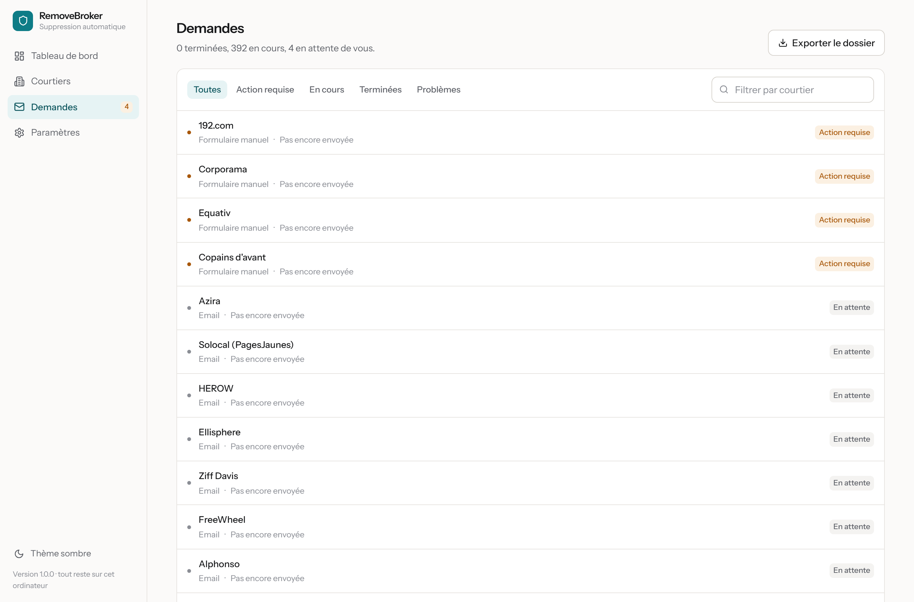
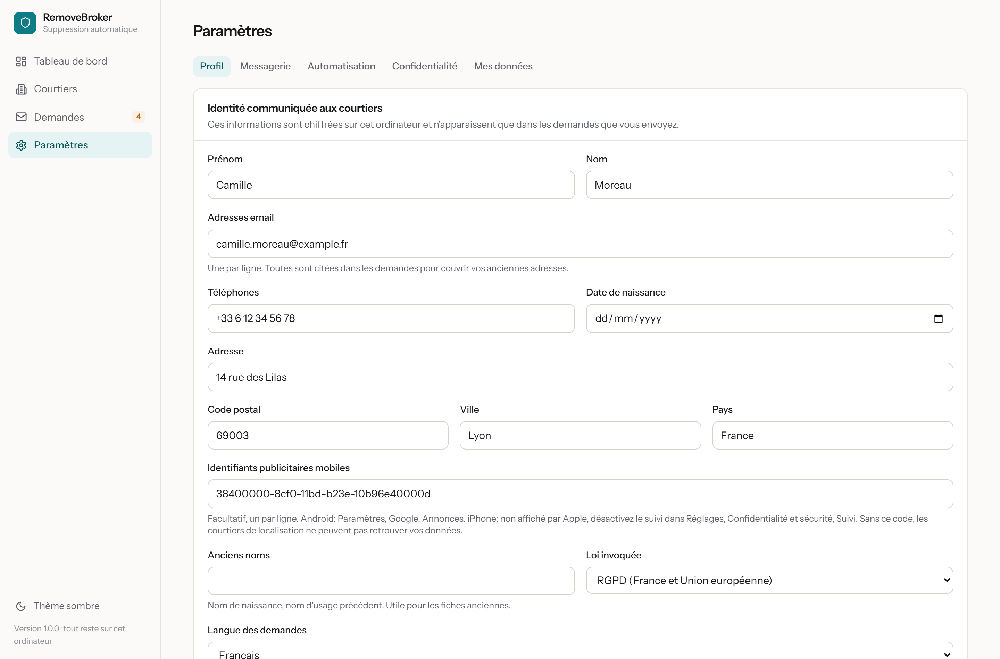

# Utilisation

Ce guide décrit ce que fait l'application une fois configurée, et les rares
moments où elle a besoin de vous.

## Le tableau de bord

Quatre chiffres résument l'état des choses:

- **En attente d'envoi** — préparées, en attente de leur tour. Une demande qui attend une action de votre part n'est pas comptée ici.
- **Envoyées** — parties, en attente de réponse. Le délai légal court à partir
  de là: un mois partout en Europe.
- **Données supprimées** — le courtier a confirmé l'effacement.
- **Action requise** — un courtier réclame quelque chose que la loi ne permet
  pas d'automatiser.

La barre de progression compte les demandes closes, quel qu'en soit le
résultat: une réponse « nous ne détenons aucune donnée vous concernant » est un
succès, pas un échec.

## Pourquoi les envois sont étalés

Une messagerie grand public bloque un compte qui envoie mille messages en une
heure. L'application s'en tient par défaut à 120 emails par jour, deux à la
fois, ce qui reste très en dessous des seuils de Gmail. Une campagne complète
prend donc plusieurs jours.

Vous pouvez suspendre et reprendre les envois à tout moment depuis le bouton en
haut du tableau de bord. Fermer l'application ne perd rien: la file reprend là
où elle s'était arrêtée.

Pour aller plus vite, augmentez la limite dans **Paramètres, Automatisation**.
Au-delà de 300 par jour sur un compte Gmail gratuit, le risque de suspension
devient réel.

## Les demandes

Chaque ligne est une demande adressée à un courtier. En l'ouvrant, vous voyez le
message exact envoyé, les réponses reçues, et l'historique horodaté.

Les statuts:

| Statut | Ce que ça veut dire |
| --- | --- |
| En attente | Préparée, pas encore envoyée |
| Envoyée | Partie, le délai légal court |
| En cours | Le courtier a accusé réception |
| Action requise | Captcha, pièce d'identité ou formulaire manuel |
| Terminée | Effacement confirmé, ou aucune donnée détenue |
| Refusée | Le courtier invoque une exception légale |
| Problème | Adresse invalide, domaine mort, envoi impossible |

### Ce qui se passe sans vous

L'application relève votre boîte email toutes les dix minutes si vous avez
connecté la réception. Elle:

1. rattache chaque réponse à la bonne demande,
2. reconnaît les confirmations, les refus et les demandes de vérification,
3. ouvre les liens de confirmation quand le courtier en envoie un,
4. relance après 30 jours de silence,
5. signale le dépassement du délai légal après 45 jours.

Les liens de confirmation ne sont ouverts que s'ils proviennent du domaine du
courtier concerné et que le message est bien lié à une demande en cours. Un lien
reçu d'ailleurs n'est jamais suivi.

### La recherche automatique du contact

Certains courtiers ne publient leur adresse nulle part dans les sources
ouvertes, souvent parce que leur site refuse les robots. L'application va alors
lire leur politique de confidentialité elle-même, avec un vrai navigateur, et en
extrait l'adresse ou le lien vers leur portail de demande. Si elle trouve une
adresse, la demande part par email comme les autres et vous ne voyez rien
passer. Cette recherche prend une trentaine de secondes par courtier et tourne
en arrière-plan, derrière les envois.

### La soumission automatique des formulaires

Désactivée par défaut, activable dans **Paramètres, Automatisation**. Une fois
active, les courtiers sans adresse email voient leur formulaire rempli et envoyé
sans que vous interveniez.

Trois situations lui font rendre la main, et c'est voulu:

- un captcha protège la page, ce qui est fréquent chez les régies publicitaires,
- aucun formulaire d'exercice de droits n'existe sur la page,
- trop peu de champs sont reconnus pour qu'une demande soit complète.

Sur un échantillon de quatre courtiers européens réels, deux étaient protégés
par un captcha. L'option aide, elle ne supprime pas tout geste.

### Ce qui a besoin de vous

Trois cas, tous marqués « Action requise »:

- **Un captcha.** Le courtier veut une preuve humaine. L'application ouvre la
  page au bon endroit; vous cliquez, elle reprend la suite.
- **Une pièce d'identité.** Certains courtiers, notamment les bureaux de crédit,
  l'exigent légitimement. C'est à vous de décider si vous la fournissez.
  L'application ne transmet jamais de document toute seule.
- **Un formulaire non automatisable.** Le lien est fourni, avec les
  informations à recopier.

Traitez-les quand vous voulez: rien n'expire.

## Les courtiers de localisation, un cas à part

Une vingtaine de sociétés du catalogue ne vendent ni votre nom ni votre adresse:
elles vendent vos **déplacements**, rattachés à l'identifiant publicitaire de
votre téléphone. Kochava, Azira, Outlogic, Foursquare, Blis et les autres
achètent ces traces à des applications qui embarquent leur code, puis les
revendent à des annonceurs, à des assureurs, parfois à des administrations.

Pour ces sociétés-là, écrire « supprimez les données de Camille Moreau » ne
donne rien: ce nom ne figure nulle part dans leurs bases. La seule clé
exploitable est votre identifiant publicitaire.

### Le récupérer

**Android.** Paramètres, Google, Tous les services, Annonces. Le code est
affiché. Copiez-le, puis choisissez « Supprimer l'identifiant publicitaire »:
les applications ne pourront plus vous suivre avec.

**iPhone.** Apple ne l'affiche nulle part. Allez dans Réglages, Confidentialité
et sécurité, Suivi, et désactivez « Autoriser les apps à demander de vous
suivre ». Votre identifiant devient une suite de zéros et plus aucune donnée ne
peut y être rattachée. Vous pouvez laisser le champ vide dans RemoveBroker: les
demandes partiront quand même, fondées sur votre adresse email.

### Où le renseigner

Au premier lancement, sur l'écran d'identité, ou plus tard dans **Paramètres,
Profil**. Le champ est facultatif. Quand il est rempli, les demandes envoyées
aux courtiers publicitaires contiennent trois exigences supplémentaires:
suppression des segments d'audience, suppression de l'historique de
localisation, et application de la demande à tous les identifiants liés au vôtre
dans leur graphe d'identité.

Supprimez l'identifiant de votre téléphone **après** l'avoir renseigné ici:
sinon vous n'aurez plus la valeur à communiquer, et les données déjà collectées
resteront chez eux.

## Quand un courtier ne répond pas

Passé le délai légal, ouvrez la demande et cliquez sur **Générer une plainte**.
L'application produit une lettre complète, adressée à l'autorité de votre pays,
avec les dates, le texte de la demande initiale, les relances et l'article de
loi applicable.

| Pays | Autorité |
| --- | --- |
| France | CNIL |
| Belgique | Autorité de protection des données |
| Suisse | PFPDT |
| Luxembourg | CNPD |
| Royaume-Uni | ICO |

La plainte est gratuite et se dépose en ligne. Un courtier qui ignore une
demande RGPD s'expose à une sanction, ce qui explique que beaucoup répondent
après une relance.

## Le dossier de preuves

**Demandes, Exporter le dossier** produit une archive contenant toutes les
demandes, toutes les réponses et l'horodatage de chaque événement. C'est ce
qu'il faut joindre à une plainte, et c'est aussi votre trace si vous quittez
l'application.

## Les courtiers

La liste est triée selon votre lieu de résidence: un profil français voit
d'abord les sociétés françaises et européennes, puis les grands acteurs
internationaux, et enfin les annuaires strictement américains.

Le filtre **Concerne l'Europe** ne se limite pas aux sociétés européennes: il
retient aussi les sociétés américaines soumises au RGPD parce qu'elles traitent
des données de personnes résidant dans l'Union.

Vous pouvez sélectionner des courtiers précis et lancer une campagne ciblée, en
masquer un qui ne vous concerne pas, ou en ajouter un manuellement si vous en
connaissez un qui manque au catalogue.

## Les réglages

- **Profil** — votre identité. La modifier n'affecte pas les demandes déjà
  envoyées.
- **Messagerie** — serveurs d'envoi et de réception, avec test de connexion.
- **Automatisation** — limite quotidienne, envois simultanés, ouverture
  automatique des liens, automatisation des formulaires.
- **Confidentialité** — mode de chiffrement, conservation des copies d'emails,
  mise à jour automatique du catalogue, journaux.
- **Mes données** — export, effacement complet.

## Nouveaux courtiers

Le catalogue est reconstruit chaque semaine dans le dépôt du projet. Votre
installation le télécharge et vous signale les nouvelles sociétés. Si le
balayage automatique est activé, les demandes correspondantes partent seules,
tous les quatorze jours par défaut.

Sinon, le bouton **Vérifier les nouveaux courtiers** du tableau de bord fait la
même chose à la demande.

## Questions fréquentes

**Combien de temps pour être effacé partout ?**
Les premières confirmations arrivent sous 48 heures. Comptez un à deux mois pour
l'essentiel, plus longtemps pour les récalcitrants.

**Mes données vont-elles revenir ?**
Oui, en partie. Les courtiers se réapprovisionnent auprès de sources publiques.
C'est pourquoi l'application relance périodiquement plutôt que de traiter le
sujet une fois pour toutes.

**Est-ce que ça peut faire suspendre ma boîte email ?**
Les limites par défaut sont conservatrices. Si vous les augmentez fortement, le
risque existe. Un compte email dédié à cet usage est une bonne précaution.

**Puis-je m'en servir depuis les États-Unis, le Canada, l'Australie ?**
Oui. Choisissez le pays correspondant au premier écran: le fondement juridique
et l'ordre des courtiers s'ajustent. Le catalogue est mondial, la priorité du
projet est l'Europe.

**Et si un courtier refuse ?**
Certains refus sont fondés: un bureau de crédit a le droit de conserver des
données de solvabilité. L'application enregistre le motif; à vous de décider si
vous contestez auprès de l'autorité.
